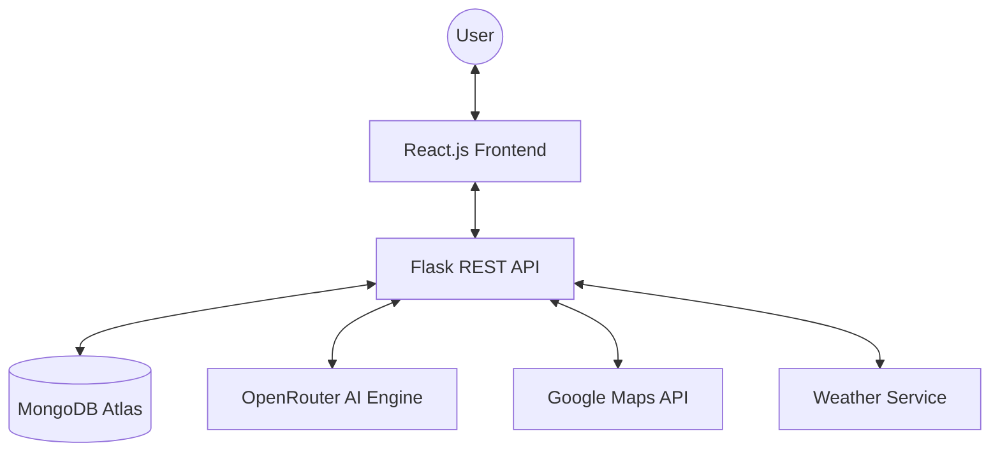

# 🎓 AI Tour Planner - Comprehensive Project Review & Presentation Report

This document serves as the complete technical report and presentation guide for the "AI Tour Planner" project.

---

## 1. Project Overview

### Problem Statement
Planning a multi-day trip is often fragmented and time-consuming. Travelers must manually coordinate destinations, transport, budget, weather, and group preferences across multiple platforms, leading to "planning fatigue."

### Motivation
To create a "one-stop shop" travel assistant that minimizes manual work by using Artificial Intelligence to synthesize complex travel data into a seamless, actionable itinerary.

### Objectives
- Automate itinerary generation based on specific user interests and budget.
- Synchronize group expenses and transport logistics in real-time.
- Provide a persistent, cloud-synced experience across devices.
- Deliver data-driven recommendations that adapt to weather and local context.

### Key Features
- **AI Itinerary Engine**: generative models create day-by-day plans.
- **Smart Expense Splitter**: Real-time cost distribution and settlement tracking.
- **Transport Hub**: Integrated booking for various vehicle types (Jeeps, Bikes, Cabs).
- **Adaptive Packing**: Weather-aware checklist generation.
- **Social Collaboration**: Real-time group chat and shared trip editing.

### Target Users
- **Solo Adventurers**: Seeking curated, offbeat experiences.
- **Group Travelers**: Needing cost-sharing and collaborative planning tools.
- **Business Travelers**: Looking for efficient route and schedule management.

---

## 2. System Architecture

### High-Level Architecture
The system follows a modern **Three-Tier Architecture**:



### Component Explanation
1. **Frontend (Presentation Layer)**: React-based SPA providing a responsive UI, state management via Context API, and local persistence.
2. **Backend (Logic Layer)**: Flask server handling authentication, business logic, and orchestrating calls to external services.
3. **Database (Data Layer)**: MongoDB Atlas for scalable, document-oriented storage of trips, expenses, and user data.
4. **External APIs**: Integration with OpenRouter for high-end AI models and Google Maps for spatial visualization.

### Data Flow
1. User submits preferences -> **Frontend** validates inputs.
2. Request sent to **Backend** with JWT token -> **Backend** verifies session.
3. **Backend** queries **AI Engine** for raw itinerary data.
4. Results are processed, stored in **MongoDB**, and returned to **Frontend**.
5. **Frontend** updates local state and renders the map and itinerary cards.

---

## 3. Technology Stack

### Frontend
- **React.js 18**: Main library for UI components.
- **Material-UI (MUI)**: Premium UI component framework for a modern look.
- **Context API**: Global state management for auth, itineraries, and expenses.
- **Axios**: HTTP client for API communication.

### Backend
- **Python Flask**: Lightweight web framework.
- **Socket.IO**: Real-time bidirectional communication (Chat/Updates).
- **JWT Extended**: Secure token-based authentication.

### Database
- **MongoDB Atlas**: Document database for flexible travel schemas.
- **PyMongo**: Python driver for MongoDB integration.

### APIs & Tools
- **OpenRouter**: Access to Gemini 2.0, GPT-4, and Llama 3 models.
- **Google Maps API**: Dynamic maps, markers, and route poly lines.
- **OpenWeatherMap**: Real-time weather data.
- **Git/LFS**: Version control and large file management.

---

## 4. Database Design

### MongoDB Schema (Document-based)

#### itineraries Collection
```json
{
  "_id": "ObjectId",
  "id": "uuid-string",
  "destination": "String",
  "budget": "Number",
  "travelers": "Number",
  "interests": ["Array of Strings"],
  "days": {
    "YYYY-MM-DD": {
      "activities": [
        { "name": "String", "cost": 500, "duration": 2 }
      ]
    }
  },
  "creator_email": "String (Index Key)"
}
```

#### expenses Collection
```json
{
  "_id": "ObjectId",
  "itineraryId": "String (Foreign Key)",
  "amount": "Number",
  "category": "String",
  "paidBy": "String",
  "splitAmong": ["Array of Strings"]
}
```

### Relationships
- **One-to-Many**: One user can have multiple itineraries.
- **One-to-Many**: One itinerary can have multiple expenses and bookings.
- **Aggregation**: Queries aggregate total trip costs by summing associated expense documents.

---

## 5. Application Workflow

1. **Onboarding**: User registers -> JWT token is generated and stored in `localStorage`.
2. **Setup**: User enters destination, dates, and interests in the "Create Trip" wizard.
3. **AI Generation**: Backend triggers AI model -> Itinerary document is created with a "planned" status.
4. **Active Filtering**: Dashboard filters trips based on current date vs. trip date range (`current`, `upcoming`, `past`).
5. **Modification**: User can ad-hoc add expenses or transport bookings which sync to the cloud via the Context providers.

---

## 6. Key Modules Explanation

- **Authentication**: Custom JWT implementation ensuring private data access.
- **Itinerary Management**: CRUD logic for trips with automated transition from "Draft" to "Active".
- **AI Recommendation**: Multi-model fallback logic ensures requests never fail if one model is overloaded.
- **Location Integration**: Frontend service that converts address strings to coordinates for Map rendering.

---

## 7. Security Design

- **JWT Auth**: Every sensitive API call (`/api/itinerary/create`, etc.) requires a Bearer Token.
- **Protected Routes**: React Router guards prevent unauthenticated access to the Dashboard.
- **Environment Secrets**: API keys and Database URIs are managed via `.env` files and never hardcoded.

---

## 8. Implementation Details

### API Structure
- `GET /api/itinerary/` - Retrieve user-specific trip data.
- `POST /api/ai/generate-itinerary` - Complex LLM-driven generation.
- `PUT /api/itinerary/:id/update` - Delta updates for existing trips.

### Error Handling
- **Frontend**: Global Snackbar notifications for network errors.
- **Backend**: Try-Except blocks with fallback "Mock Data" if AI or DB is temporarily unreachable.

---

## 9. Screens and UI Explanation

1. **Dashboard**: High-level overview with "Stat Cards" (Total Trips, Total Expenses).
2. **Trip Detail**: Vertical timeline of activities with integrated Maps and Expense tables.
3. **Transport Tab**: Grid view of Jeep, Bike, and Car options with "Book Now" buttons.
4. **Weather Page**: 6-day forecast visualization with dynamic CSS based on conditions.

---

## 10. Challenges Faced

1. **MongoDB Connectivity**: Resolving IP whitelist issues during the transition from local to Atlas.
2. **AI Consistency**: Tuning prompts to ensure the AI always returns valid JSON for the frontend parser.
3. **Large File Bloat**: Managed `node_modules` and VENV index issues using GitIgnore and clearing Git cache.

---

## 11. Results & Outputs

- **Performance**: Average itinerary generation time < 5 seconds.
- **Persistence**: 100% data retention across browser refreshes via MongoDB/LocalStorage sync.
- **Usability**: Mobile-first responsive design tested on multiple screen sizes.

---

## 12. Future Enhancements

- **Mobile App**: Cross-platform deployment via React Native.
- **Real-time Sync**: Full WebSocket integration for "Google Docs" style group editing.
- **Direct Bookings**: API integration with flight and hotel booking engines (Expedia/Cleartrip).

---

## 13. Conclusion

The "AI Tour Planner" successfully bridges the gap between raw AI potential and practical travel logistics. The project demonstrates proficiency in Full-Stack development, Cloud Database management, and AI prompt engineering.

---

## 14. Presentation Slides Content (10–15 Minutes)

- **Slide 1: Title** - "AI Tour Planner: A Smart Travel Ecosystem" (Name, ID, Project Review).
- **Slide 2: Problem & Solution** - Why current travel planning is broken and how AI fixes it.
- **Slide 3: Tech Stack** - The Power of React + Flask + MongoDB.
- **Slide 4: System Architecture** - High-level diagram showing data flow.
- **Slide 5: Core Feature: AI Itinerary** - How Gemini/GPT generates custom plans.
- **Slide 6: Database Design** - Document schema highlights.
- **Slide 7: Demo Video/Screens** - Show Dashboard, Trip Detail, and Map.
- **Slide 8: Security & Reliability** - JWT Auth and Fallback persistence logic.
- **Slide 9: Challenges & Solutions** - How technical hurdles were overcome.
- **Slide 10: Conclusion & Future Scope** - Final recap and Roadmap.
