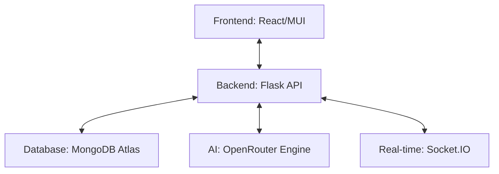

# AI-Powered Tour Planner - Technical Documentation

## 1. System Architecture

### 1.1 High-Level Architecture


## 2. Data Schema (MongoDB)

### 2.1 Itineraries
```json
{
  "id": "itinerary-123456",
  "destination": "Name",
  "source": "Name",
  "start_date": "ISO8601",
  "end_date": "ISO8601",
  "budget": 50000,
  "travelers": 2,
  "interests": ["Culture", "Nature"],
  "status": "created|planned",
  "days": {
    "2024-05-01": {
      "day": 1,
      "activities": [
        { "name": "...", "duration": 2, "cost": 500 }
      ]
    }
  }
}
```

## 3. API Endpoints

### 3.1 AI Services
- `POST /api/ai/generate-itinerary` - Generate full trip plan.
- `POST /api/ai/recommend-destinations` - Get destination suggestions.
- `POST /api/ai/optimize-budget` - Budget breakdown & tips.
- `POST /api/ai/translate` - Whisper-style translation.
- `POST /api/ai/eco-score` - Sustainability analysis.
- `POST /api/ai/cultural-compass` - Etiquette & tips.
- `POST /api/ai/buddy-match` - Social matching suggestions.

### 3.2 Core Itineraries
- `GET /api/itinerary/` - List all itineraries.
- `POST /api/itinerary/create` - Create new itinerary.
- `GET /api/itinerary/:id` - Get specific details.
- `POST /api/itinerary/:id/generate` - Run AI generation for existing trip.

### 3.3 Expenses & Transport
- `POST /api/expenses/add` - Add new expense.
- `GET /api/expenses` - List all expenses.
- `POST /api/transport/book` - Confirm booking.
- `GET /api/transport/bookings` - List all bookings.

## 4. AI Multi-Model Fallback

The system uses a robust fallback mechanism for AI requests via OpenRouter:
1. `google/gemini-2.0-flash-001` (Primary)
2. `google/gemini-1.5-flash-v1.0`
3. `meta-llama/llama-3.2-11b-vision-instruct`
4. `openai/gpt-3.5-turbo`

## 5. Persistence Strategy

1. **MongoDB Atlas**: Primary cloud storage for all data.
2. **LocalStorage**: Frontend cache for instant UI response and offline support.
3. **In-Memory Fallback**: Backend maintains a dictionary-based storage if MongoDB connection fails.
